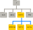

::::::::::::::::::::::::::::::::::::::: objectives

- Пояснити подібності та відмінності між файлом і каталогом.
- Перетворити абсолютний шлях у відносний і навпаки.
- Створити абсолютні та відносні шляхи, які ідентифікують певні файли та каталоги.
- Використати опції та аргументи для зміни поведінки команд у терміналі.
- Продемонструвати використання табуляції для автоматичного доповнення та пояснити його переваги.

::::::::::::::::::::::::::::::::::::::::::::::::::

:::::::::::::::::::::::::::::::::::::::: questions

- Як я можу пересуватися по файловій системі на моєму комп'ютері?
- Як я можу переглянути файли та каталоги на своєму комп’ютері?
- Як я можу вказати, де знаходиться файл або каталог на моєму комп'ютері?

::::::::::::::::::::::::::::::::::::::::::::::::::

:::::::::::::::::::::::::::::::::::::::: instructor

Ознайомлення та навігація з файловою системою у терміналі (про яку йдеться у розділі [Навігація файлами та каталогами](02-filedir.md)) можуть бути складними. Ви можете відкрити термінал та графічний провідник файлів поруч, щоб учні могли бачити вміст і структуру файлів, коли вони використовують термінал для навігації системою.

::::::::::::::::::::::::::::::::::::::::::::::::::

Частина операційної системи, яка відповідає за роботу з файлами та каталогами, називається **файловою системою**.
Вона організує наші дані у файли, які зберігають інформацію, та каталоги (також відомі як 'теки'), які містять файли або інші підкаталоги.

Для створення, перевірки, перейменування та видалення файлів і каталогів зазвичай використовується декілька команд.
Щоб розглянути їх, перейдемо до нашого відкритого вікна терміналу.

По-перше, дізнаймося, де ми знаходимося, запустивши команду `pwd` (англ. 'print working directory' - надрукувати робочий каталог). Каталоги подібні до _місцезнаходження_ - у будь-який момент, коли ми використовуємо термінал, ми знаходимося в одному місці, яке називається **поточним робочим каталогом**. Команди здебільшого читають та записують файли в поточний робочий каталог, тобто "сюди". Тому дуже важливо розуміти де ви знаходитесь перед виконанням команди. Команда `pwd` покаже вам, де ви знаходитесь:

```bash
$ pwd
```

```output
/Users/nelle
```

У наведеному прикладі комп'ютер відповів `/Users/nelle`, що є **домашнім каталогом** Неллі:

:::::::::::::::::::::::::::::::::::::::::  callout

## Варіації домашнього каталогу

Розташування домашнього каталогу виглядає по-різному в різних операційних системах.
В Linux воно може виглядати як `/home/nelle`, а у Windows воно буде схоже на `C:\Documents and Settings\nelle` чи `C:\Users\nelle`.
(Зауважте, що воно може виглядати дещо інакше для різних версій Windows.)
У наведених нижче прикладах ми використовували результати у тому вигляді, у якому вони виглядають у macOS. Хоча вихідні дані Linux і Windows можуть дещо відрізнятися, загалом вони мають бути схожими.

Ми також припустимо, що ваша команда `pwd` повертає вашу домашню директорію користувача.
Якщо команда `pwd` повертає щось інше, вам доведеться перейти у ваш домашній каталог за допомогою команди `cd`, інакше деякі команди в цьому уроці не будуть працювати належним чином.
Дивіться [Перегляд інших каталогів](#exploring-other-directories) для додаткової інформації про команду `cd`.

::::::::::::::::::::::::::::::::::::::::::::::::::

Для того, щоб зрозуміти, що таке 'домашній каталог', розглянемо як організована файлова система в цілому.  Для цього прикладу ми проілюструємо файлову систему на комп’ютері морського біолога Неллі.  Після цього прикладу ви вивчатимете команди для дослідження власної файлової системи, яка буде побудована подібним чином, але не буде абсолютно ідентичною.

На комп’ютері Неллі файлова система виглядає так:

{alt='Файлова система складається з кореневого каталогу, який містить підкаталоги з назвами bin, data, users та tmp'}

Файлова система виглядає як перевернуте дерево.
Найвищим каталогом є **кореневий каталог**, який містить усе інше.
Ми посилаємося на нього за допомогою символу скісної риски `/` (зауважте, що він є першим символом у рядку `/Users/nelle`).

Усередині цього каталогу є кілька інших каталогів: `bin` (в якому зберігаються певні вбудовані програми), `data` (для різноманітних файлів даних), `Users` (де знаходяться особисті директорії користувачів), `tmp` (для файлів тимчасового зберігання) та інші.

Ми знаємо, що наш поточний робочий каталог `/Users/nelle` зберігається всередині каталогу `/Users`, тому що `/Users` є першою частиною його імені.
Відповідно, нам відомо, що каталог `/Users` зберігається всередині кореневої директорії `/`, бо його ім'я розпочинається з символу `/`.

:::::::::::::::::::::::::::::::::::::::::  callout

## Символи скісної риски

Зверніть увагу, що символ `/` має два значення.
Коли він з’являється на початку назви файлу чи каталогу, це посилання на кореневу директорію. Коли він використовується _всередині_ шляху, це лише роздільник.

::::::::::::::::::::::::::::::::::::::::::::::::::

На комп'ютері Неллі, у каталозі `/Users` є підкаталог для кожного користувача з обліковим записом, наприклад: для її колег _imhotep_ та _larry_.

{alt='Як і інші каталоги, домашні каталоги є підкаталогами
"/Users", наприклад "/Users/imhotep", "/Users/larry" або "/Users/nelle"'}

Файли користувача _imhotep_ зберігаються в каталозі `/Users/imhotep`, користувача _larry_ - в `/Users/larry`, і Неллі - в `/Users/nelle`. Оскільки саме Неллі є користувачем у наших прикладах, тому ми отримуємо `/Users/nelle` як наш домашній каталог.
Зазвичай, коли ви відкриваєте нове вікно терміналу, ви опиняєтесь у своєму домашньому каталозі.

Тепер розглянемо команду, яка дозволить нам бачити вміст нашої власної файлової системи.  Ми можемо побачити, що знаходиться у нашому домашньому каталозі, запустивши `ls`:

```bash
$ ls
```

```output
Applications Documents    Library      Music        Public
Desktop      Downloads    Movies       Pictures
```

(Знову ж таки, ваші результати можуть дещо відрізнятися залежно від вашої операційної системи та того, як ви налаштували свою файлову систему.)

`ls` друкує назви файлів і каталогів у поточному каталозі.
Ми можемо зробити його вивід більш зрозумілим за допомогою **опції** `-F`, яка вказує `ls` класифікувати вивід, додаючи маркер до імен файлів і каталогів, щоб вказати, що вони собою являють:

- символ `/` наприкінці імені вказує на те, що це каталог
- символ `@` вказує на посилання
- символ `*` вказує на виконуваний файл

Залежно від налаштувань терміналу за замовчуванням, він також може використовувати кольори для позначення файлів та каталогів, щоб краще їх розрізняти.

```bash
$ ls -F
```

```output
Applications/ Documents/    Library/      Music/        Public/
Desktop/      Downloads/    Movies/       Pictures/
```

В наведеному прикладі ми бачимо, що наш домашній каталог містить лише **підкаталоги**.
Будь-які імена у вихідних даних, які не мають символу класифікації, є **файлами**, розташованими в поточному робочому каталозі.

:::::::::::::::::::::::::::::::::::::::::  callout

## Як очистити термінал

Якщо екран стає занадто захаращеним, ви можете очистити термінал за допомогою команди `clear`. Ви все ще можете отримати доступ до попередніх команд за допомогою клавіш <kbd>↑</kbd> та <kbd>↓</kbd> для переміщення по рядках, або за допомогою прокрутки у вашому терміналі.

::::::::::::::::::::::::::::::::::::::::::::::::::

### Отримання допомоги

У `ls` є багато інших опцій. Існує два поширених способи дізнатися, як використовувати команду і які параметри вона приймає --- **залежно від вашого середовища, ви можете виявити, що працює лише один із цих способів:**

1. Ми можемо передати команді опцію `--help` (доступну в Linux і Git Bash), наприклад:

```bash
$ ls --help
```

2. Ми можемо переглянути інструкцію до використання команди за допомогою `man` (доступної на Linux і macOS), наприклад:

```bash
$ man ls
```

Далі ми роздивимось обидва способи.

:::::::::::::::::::::::::::::::::::::::::  callout

## Довідка для вбудованих команд

Деякі команди вбудовано в оболонку Bash, а не існують як окремі програми у файловій системі. Одним із прикладів є команда `cd` (зміна каталогу).
Якщо після команди `man cd` ви отримуєте повідомлення на кшталт `No manual entry for cd`, спробуйте натомість `help cd`. За допомогою команди `help` ви можете отримати інформацію про використання [вбудованих команд Bash](https://www.gnu.org/software/bash/manual/html_node/Bash-Builtins.html).

::::::::::::::::::::::::::::::::::::::::::::::::::

#### Опція \`--help'

Більшість команд bash і програм, написаних людьми для запуску з bash, підтримують опцію `--help`, яка виводить додаткову інформацію про те, як користуватися відповідною командою або програмою.

```bash
$ ls --help
```

```output
Usage: ls [OPTION]... [FILE]...
List information about the FILEs (the current directory by default).
Sort entries alphabetically if neither -cftuvSUX nor --sort is specified.

Mandatory arguments to long options are mandatory for short options, too.
  -a, --all                  do not ignore entries starting with .
  -A, --almost-all           do not list implied . and ..
      --author               with -l, print the author of each file
  -b, --escape               print C-style escapes for nongraphic characters
      --block-size=SIZE      scale sizes by SIZE before printing them; e.g.,
                               '--block-size=M' prints sizes in units of
                               1,048,576 bytes; see SIZE format below
  -B, --ignore-backups       do not list implied entries ending with ~
  -c                         with -lt: sort by, and show, ctime (time of last
                               modification of file status information);
                               with -l: show ctime and sort by name;
                               otherwise: sort by ctime, newest first
  -C                         list entries by columns
      --color[=WHEN]         colorize the output; WHEN can be 'always' (default
                               if omitted), 'auto', or 'never'; more info below
  -d, --directory            list directories themselves, not their contents
  -D, --dired                generate output designed for Emacs' dired mode
  -f                         do not sort, enable -aU, disable -ls --color
  -F, --classify             append indicator (one of */=>@|) to entries
...        ...        ...
```

:::::::::::::::::::::::::::::::::::::::::  callout

### Коли використовувати короткі або довгі опції

Коли існують як короткі, так і довгі опції:

- Використовуйте коротку під час введення команд безпосередньо в термінал, щоб мінімізувати натискання клавіш і швидше виконувати завдання.
- Використовуйте довгу опцію у скриптах для наочності.
  It will be read many times and typed once.

::::::::::::::::::::::::::::::::::::::::::::::::::

:::::::::::::::::::::::::::::::::::::::::  callout

## Непідтримувані параметри командного рядка

Якщо ви спробуєте використати параметр, який не підтримується терміналом, `ls` та інші команди зазвичай виводитимуть повідомлення про помилку, схоже на:

```bash
$ ls -j
```

```error
ls: invalid option -- 'j'
Try 'ls --help' for more information.
```

::::::::::::::::::::::::::::::::::::::::::::::::::

#### Команда `man`

Інший спосіб дізнатися про `ls` - ввести

```bash
$ man ls
```

Ця команда виведе у вашому терміналі сторінку з описом команди `ls` та її опцій.

Для навігації сторінками `man` ви можете використовувати <kbd>↑</kbd> і <kbd>↓</kbd> для переміщення по рядках, або спробувати <kbd>b</kbd> і <kbd>Spacebar</kbd> для переходу вгору і вниз на цілу сторінку.
Для пошуку символу або слова на сторінках `man`, використовуйте клавішу <kbd>/</kbd> та слідом введіть символ або слово, яке ви шукаєте.
Іноді пошук може призвести до кількох результатів.
У такому випадку ви можете переміщатися між результатами за допомогою клавіш <kbd>N</kbd> (для переходу вперед) та <kbd>Shift</kbd>\+<kbd>N</kbd> (для переходу назад).

Щоб **вийти** зі сторінок `man`, натисніть <kbd>q</kbd>.

:::::::::::::::::::::::::::::::::::::::::  callout

## Сторінки з інструкціями в Інтернеті

Звісно, є й третій спосіб отримати доступ до довідки для команд: пошук в інтернеті за допомогою веббраузера.
Якщо ви скористаєтеся пошуком в Інтернеті, додання до запиту фрази `unix man page` дозволить отримати більш доречні результати.

GNU надає посилання на свої [посібники](http://www.gnu.org/manual/manual.html), зокрема на [основні утиліти GNU](http://www.gnu.org/software/coreutils/manual/coreutils.html), які охоплюють багато команд, представлених у цьому уроці.

::::::::::::::::::::::::::::::::::::::::::::::::::

:::::::::::::::::::::::::::::::::::::::  challenge

## Вивчення інших опцій `ls`

Ви також можете використовувати декілька опцій одночасно. Що робить команда `ls` при використанні з опцією `-l`? А якщо ви використовуєте `-l` та `-h` одночасно?

Деякі з результатів виконання команди стосуються властивостей, які ми не розглядаємо у цьому семінарі (наприклад, права доступу до файлів та їх власники), але решта все одно буде корисною.

:::::::::::::::  solution

## Розв'язок

Опція `-l` змушує `ls` використовувати довгий (англ. **l**ong) формат виводу, показуючи не лише назви файлів/директорій, але й додаткову інформацію, таку як розмір файлу і час його останньої модифікації. Якщо ви використовуєте як `-h`, так і `-l`, це зробить виведення розміру файлу у більш зрозумілому людині вигляді ("**h**uman readable"), тобто покаже щось на кшталт `5.3K` замість `5369`.

:::::::::::::::::::::::::

::::::::::::::::::::::::::::::::::::::::::::::::::

:::::::::::::::::::::::::::::::::::::::  challenge

## Виведення у зворотному хронологічному порядку

За замовчуванням `ls` виводить вміст каталогу в алфавітному порядку за іменами елементів. Команда `ls -t` перелічує елементи за часом останньої зміни, а не за алфавітом. Команда `ls -r` виводить вміст каталогу у зворотному порядку.
Який файл буде показано останнім при комбінації опцій `-t` і `-r`?
Підказка: Вам потрібно скористатися опцією `-l`, щоб переглянути дати останніх змін.

:::::::::::::::  solution

## Розв'язання

При використанні `-rt` останній змінений файл є останнім у списку. Це може бути дуже корисним для пошуку ваших останніх редагувань або перевірки чи було створено новий вихідний файл.

:::::::::::::::::::::::::

::::::::::::::::::::::::::::::::::::::::::::::::::

### Перегляд інших каталогів

Ми можемо використовувати `ls` не лише у поточному робочому каталозі, але й для виведення вмісту іншого каталогу.
Подивимося на наш каталог `Desktop` (робочий стіл), виконавши `ls -F Desktop`, тобто, команду `ls` з **опцією** `-F` і [**аргументом**][Arguments] `Desktop`.
Аргумент `Desktop` повідомляє `ls`, що ми хочемо отримати список чогось іншого, ніж наш поточний робочий каталог:

```bash
$ ls -F Desktop
```

```output
shell-lesson-data/
```

Зауважте, що якщо у вашому поточному робочому каталозі не існує каталогу з назвою `Desktop`, ця команда поверне помилку. Зазвичай, підкаталог `Desktop` існує у вашому домашньому каталозі, який ми вважаємо поточним робочим каталогом вашого терміналу bash.

На виході ви маєте отримати список усіх файлів і підкаталогів у вашому каталозі Desktop, включно з каталогом `shell-lesson-data`, який ви завантажили за посиланням під час [налаштувань для цього уроку](../learners/setup.md). (On most systems, the
contents of the `Desktop` directory in the shell will show up as icons in a graphical
user interface behind all the open windows. Подивіться, чи це ваш випадок.)

Ієрархічна організація речей таким чином допомагає нам відстежувати нашу роботу. Хоча у нашому домашньому каталозі можна зберігати сотні файлів, так само як і сотні паперових документів на робочому столі, набагато легше знаходити речі, коли вони організовані у підкаталоги з розумними назвами.

Тепер, коли ми знаємо, що каталог `shell-lesson-data` знаходиться у каталозі Desktop, ми можемо зробити дві речі.

По-перше, ми можемо переглянути його вміст, використовуючи ту ж стратегію, що і раніше, передавши ім'я каталогу в `ls`:

```bash
$ ls -F Desktop/shell-lesson-data
```

```output
exercise-data/  north-pacific-gyre/
```

По-друге, ми можемо змінити наше місцезнаходження на інший каталог, щоб ми більше не знаходилися в нашому домашньому каталозі.

Командою для зміни каталогів є `cd`, після якої йде назва каталогу, до якого ви хочете перейти. Це оновить поточний робочий каталог.
`cd` означає 'змінити каталог' (англ. 'change directory'), що трохи вводить в оману.
Команда не змінює сам каталог;
вона змінює поточний робочий каталог у терміналі.
Іншими словами, вона змінює налаштування терміналу щодо того, в якому каталозі ми знаходимося.
Команда `cd` подібна до подвійного клацання по каталогу в графічному інтерфейсі, щоб потрапити до нього.

Припустимо, нам треба перейти до каталогу `exercise-data`, який ми бачили вище. Ми можемо скористатися наступною серією команд, щоб дістатися туди:

```bash
$ cd Desktop
$ cd shell-lesson-data
$ cd exercise-data
```

Ці команди перемістять нас з домашнього каталогу до Desktop, потім до `shell-lesson-data`, а потім до `exercise-data`.
Ви помітите, що команда `cd` нічого не виводить. Це нормально.
Багато команд терміналу нічого не виводять на екран після успішного виконання.
Але якщо ми виконаємо `pwd` після неї, то побачимо, що зараз ми знаходимося у `/Users/nelle/Desktop/shell-lesson-data/exercise-data`.

Тепер, якщо ми виконаємо команду `ls -F` без аргументів, вона виведе вміст `/Users/nelle/Desktop/shell-lesson-data/exercise-data`, тому що саме там ми зараз знаходимося:

```bash
$ pwd
```

```output
/Users/nelle/Desktop/shell-lesson-data/exercise-data
```

```bash
$ ls -F
```

```output
alkanes/  animal-counts/  creatures/  numbers.txt  writing/
```

Тепер ми знаємо, як рухатися вниз по дереву каталогів (тобто, як перейти до підкаталогу), але як рухатися вгору (тобто, як вийти з каталогу і перейти до його батьківського каталогу)?
Ми можемо спробувати наступне:

```bash
$ cd shell-lesson-data
```

```error
-bash: cd: shell-lesson-data: No such file or directory
```

Але ми отримуємо помилку! Чому?

За допомогою поки що знайомих нам методів, `cd` може бачити лише підкаталоги у вашому поточному каталозі. Існують різні способи перегляду батьківських каталогів; ми почнемо з найпростішого.

У терміналі є скорочення для переходу на один рівень каталогу вгору. Це працює наступним чином:

```bash
$ cd ..
```

`..` - це спеціальне ім'я каталогу, що означає "каталог, що містить поточний", або більш стисло, **батько** поточного каталогу.
Звичайно, якщо ми запустимо `pwd` після виконання `cd ..`, ми знову у `/Users/nelle/Desktop/shell-lesson-data`:

```bash
$ pwd
```

```output
/Users/nelle/Desktop/shell-lesson-data
```

Спеціальний каталог `..` зазвичай не з'являється, коли ми запускаємо `ls`. Якщо ми хочемо побачити його, ми можемо додати опцію `-a` до `ls -F`:

```bash
$ ls -F -a
```

```output
./  ../  exercise-data/  north-pacific-gyre/
```

`-a` означає 'показати все' (англ. show all) (включно з прихованими файлами); ця опція змушує `ls` показувати нам імена файлів і каталогів, які починаються з `.`, наприклад, `..` (яке, якщо ми знаходимося у `/Users/nelle`, вказує на каталог `/Users`).
Як ви можете бачити, команда також показує ще один спеціальний каталог, який називається `.`, що означає 'поточний робочий каталог'.
Може здатися, що це дещо надлишково - мати для нього ім'я, але незабаром ми побачимо, як воно може бути використано.

Зауважте, що у більшості інструментів командного рядка можна комбінувати декілька параметрів за допомогою одного `-` і без пробілів між параметрами: `ls -F -a` є еквівалентним до `ls -Fa`.

:::::::::::::::::::::::::::::::::::::::::  callout

## Інші приховані файли

Крім прихованих каталогів `..` та `.`, ви також можете побачити файл з назвою `.bash_profile`. Цей файл зазвичай містить конфігурацію терміналу. Ви також можете зустріти інші файли й каталоги, які починаються з символу `.`. Зазвичай це конфігураційні файли та каталоги, які використовуються різними програмами на вашому комп’ютері для налаштування. Префікс `.` використовується для того, щоб ці конфігураційні файли не захаращували термінал, коли використовується стандартна команда `ls`.

::::::::::::::::::::::::::::::::::::::::::::::::::

Ці три команди є основними командами для навігації по файловій системі на вашому комп'ютері: `pwd`, `ls` і `cd`. Розгляньмо деякі варіації цих команд. Що станеться якщо ви введете команду `cd` саму по собі, не зазначаючи каталог?

```bash
$ cd
```

Як перевірити, що сталося? Команда `pwd` дає нам відповідь!

```bash
$ pwd
```

```output
/Users/nelle
```

Виявляється, `cd` без аргументу поверне вас до домашнього каталогу, що дуже зручно, якщо ви загубилися у власній файловій системі.

Спробуємо повернутися до каталогу `exercise-data`. Минулого разу ми використовували три команди, але насправді ми можемо поєднати перелік каталогів для переходу до каталогу `exercise-data` за один крок:

```bash
$ cd Desktop/shell-lesson-data/exercise-data
```

Переконайтеся, що ми перемістилися в потрібне місце, виконавши `pwd` і `ls -F`.

Щоб перейти на один рівень вище від каталогу даних, ми можемо використати `cd ..`.  Але існує інший спосіб переміщення до будь-якого каталогу, незалежно від вашого поточного розташування.

Дотепер, ми використовували **відносні шляхи** для вказування назви каталогів або навіть шляхів до каталогів (як описано вище).  Він повідомляє таким командам, як ls або cd, знайти каталог на основі нашої поточної позиції у файловій системі, а не з кореня файлової системи.

Однак ми також можемо використовувати **абсолютні шляхи**, які вказують повне розташування каталогу, починаючи від кореневого каталогу, який позначається символом скісної риски (/). Символ `/` на початку абсолютного шляху вказує комп'ютеру слідувати шляхом від кореня файлової системи, тому шлях інтерпретується однаково, незалежно від нашого поточного каталогу.

Це дає змогу перейти до каталогу `shell-lesson-data` з будь-якого місця у файловій системі (у тому числі з каталогу `exercise-data`). Щоб знайти абсолютний шлях ми можемо скористатися `pwd`, а потім витягти потрібний нам фрагмент, щоб перейти до `shell-lesson-data`.

```bash
$ pwd
```

```output
/Users/nelle/Desktop/shell-lesson-data/exercise-data
```

```bash
$ cd /Users/nelle/Desktop/shell-lesson-data
```

Виконайте `pwd` і `ls -F`, щоб переконатися, що ми знаходимося в потрібному каталозі.

:::::::::::::::::::::::::::::::::::::::::  callout

## Ще два скорочення

Термінал інтерпретує символ тильди (`~`) на початку шляху як "домашній каталог поточного користувача". Наприклад, якщо домашнім каталогом користувача Неллі є каталог `/Users/nelle`, то `~/data` еквівалентно `/Users/nelle/data`. Це працює лише у випадку, якщо це перший символ у шляху: `here/there/~/elsewhere` _не_ є`here/there/Users/nelle/elsewhere`.

Іншим скороченням є символ `-` (тире). `cd` інтерпретує `-` як _попередній каталог, у якому я був_, що є швидше, ніж запам'ятовувати, а потім набирати повний шлях.  Це _дуже_ ефективний спосіб переміщення _між двома каталогами_ - тобто, якщо ви виконаєте `cd -` двічі, це повертає вас до початкового каталогу.

The difference between `cd ..` and `cd -` is
that the former brings you _up_, while the latter brings you _back_.

***

Спробуйте!
Спочатку перейдіть до `~/Desktop/shell-lesson-data` (ви вже маєте бути там).

```bash
$ cd ~/Desktop/shell-lesson-data
```

Потім `cd` у каталог `exercise-data/creatures`

```bash
$ cd exercise-data/creatures
```

Тепер, якщо ви виконаєте

```bash
$ cd -
```

ви побачите, що повернулися до `~/Desktop/shell-lesson-data`.
Запустіть `cd -` ще раз і ви повернетесь до `~/Desktop/shell-lesson-data/exercise-data/creatures`

::::::::::::::::::::::::::::::::::::::::::::::::::

:::::::::::::::::::::::::::::::::::::::  challenge

## Абсолютні та відносні шляхи

Якщо Неллі зараз знаходиться в `/Users/nelle/data`, то яка з наведених нижче команд дозволить їй повернутися до її домашнього каталогу `/Users/nelle`?

1. `cd .`
2. `cd /`
3. `cd /home/nelle`
4. `cd ../..`
5. `cd ~`
6. `cd home`
7. `cd ~/data/..`
8. `cd`
9. `cd ..`

:::::::::::::::  solution

## Розв'язання

1. Ні: скорочення `.` означає поточний каталог.

2. Ні: скорочення `/` означає кореневий каталог.

3. Ні: домашнім каталогом Неллі є `/Users/nelle`.

4. Ні: ця команда переходить на два рівні вгору, тобто до `/Users`.

5. Так: символ `~` позначає домашній каталог користувача, у цьому випадку `/Users/nelle`.

6. Ні: ця команда виконає перехід до каталогу `home` у поточному каталозі, якщо він існує.

7. Так: надмірно складна, але правильна.

8. Так: скорочення для повернення до домашнього каталогу користувача.

9. Так: підіймається на один рівень вище в структурі каталогів.

:::::::::::::::::::::::::

::::::::::::::::::::::::::::::::::::::::::::::::::

:::::::::::::::::::::::::::::::::::::::  challenge

## Завдання відносного шляху

Використовуючи наведену нижче схему файлової системи, якщо `pwd` показує `/Users/thing`, що покаже команда `ls -F ../backup`?

1. `../backup: No such file or directory (не існує такого файлу або каталогу)`
2. `2012-12-01 2013-01-08 2013-01-27`
3. `2012-12-01/ 2013-01-08/ 2013-01-27/`
4. `original/ pnas_final/ pnas_sub/`

{alt='Дерево каталогів під каталогом Users, де "/Users" містить каталоги "backup" та "thing"; "/Users/backup" містить "original", "pnas\_final" та "pnas\_sub"; "/Users/thing" містить "backup"; та "/Users/thing/backup" містить "2012-12-01", "2013-01-08" та "2013-01-27"'}

:::::::::::::::  solution

## Розв'язання

1. Ні: у каталозі`/Users` існує підкаталог `backup`.

2. Ні: це вміст каталогу `Users/thing/backup`, але за допомогою `..` ми просили піднятися на один рівень вище.

3. Ні: див. попереднє пояснення.

4. Так: `../backup/` вказує на `/Users/backup/`.

:::::::::::::::::::::::::

::::::::::::::::::::::::::::::::::::::::::::::::::

:::::::::::::::::::::::::::::::::::::::  challenge

## Розуміння команди `ls`

Звертаючись до діаграми файлової системи нижче, якщо `pwd` повертає `/Users/backup`, а параметр `-r` у команді `ls` змінює порядок виведення результатів, яка (які) команда (команди) призведе до наступного результату:

```output
pnas_sub/ pnas_final/ original/
```

{alt='Дерево каталогів під каталогом Users, де "/Users" містить каталоги "backup" та "thing"; "/Users/backup" містить "original", "pnas_final" та "pnas_sub"; "/Users/thing" містить "backup"; та "/Users/thing/backup" містить "2012-12-01", "2013-01-08" та "2013-01-27"'}

1. `ls pwd`
2. `ls -r -F`
3. `ls -r -F /Users/backup`

:::::::::::::::  solution

## Відповідь

1. Ні: `pwd` не є назвою каталогу.

2. Так: команда `ls` без аргументу перелічує файли й каталоги у поточному каталозі.

3. Так: чітко використовує абсолютний шлях.

:::::::::::::::::::::::::

::::::::::::::::::::::::::::::::::::::::::::::::::

## Загальний синтаксис команд терміналу

Ми вже познайомилися з командами, опціями та аргументами, але, можливо, буде корисно формалізувати деяку термінологію.

Розглянемо команду нижче як приклад і розберемо її на складові частини:

```bash
$ ls -F /
```

{alt='Загальний синтаксис команди терміналу'}

`ls` - це **команда**, з **опцією** `-F` та **аргументом** `/`.
Ми вже зустрічалися з опціями, які починаються з одного тире (`-`), відомі як **короткі варіанти**, або двох тире (`--`), відомі як **довгі варіанти**.
\[Опції] змінюють поведінку команди, а \[аргументи] вказують команді, над чим вона має працювати (наприклад, над файлами й каталогами).
Іноді опції та аргументи називають **параметрами**.
A command can be called with more than one option and more than one argument, but a
command doesn't always require an argument or an option.

You might sometimes see options being referred to as **switches** or **flags**,
especially for options that take no argument. У цьому уроці ми будемо дотримуватися терміну _опція_.

Кожна частина відокремлюється пробілами. Якщо ви пропустите пробіл між `ls` і `-F`, термінал шукатиме команду з назвою `ls-F`, якої не існує. Also, capitalization can be important.
For example, `ls -s` will display the size of files and directories alongside the names,
while `ls -S` will sort the files and directories by size, as shown below:

```bash
$ cd ~/Desktop/shell-lesson-data
$ ls -s exercise-data
```

```output
total 28
 4 animal-counts   4 creatures  12 numbers.txt   4 alkanes   4 writing
```

Зверніть увагу, що розміри, які повертає команда `ls -s`, подано у _блоках_.
Оскільки вони визначаються по-різному для різних операційних систем, ви можете отримати не такі значення, як у прикладі.

```bash
$ ls -S exercise-data
```

```output
animal-counts  creatures  alkanes  writing  numbers.txt
```

Putting all that together, our command `ls -F /` above gives us a listing
of files and directories in the root directory `/`.
Нижче наведено приклад результату, який ви можете отримати від цієї команди:

```bash
$ ls -F /
```

```output
Applications/         System/
Library/              Users/
Network/              Volumes/
```

### Конвеєр Неллі: Організація файлів

Знаючи так багато про файли та каталоги, Неллі готова впорядкувати файли, які створить машина для аналізу білків.

Вона створює каталог під назвою `north-pacific-gyre` (щоб нагадати собі, звідки взялися дані), який міститиме файли даних з аналітичної машини та її скрипти для обробки даних.

Кожному фізичному зразку присвоюється унікальний десятисимвольний ідентифікатор, наприклад 'NENE01729A', згідно з затвердженими в лабораторії правилами.
Оскільки цей ідентифікатор вона використовує у своєму журналі для документування таких деталей, як місцезнаходження, часу і глибини, то вона додає його до імен своїх файлів даних.
Оскільки результат роботи аналізатора є звичайним текстом, вона назве свої файли `NENE01729A.txt`, `NENE01812A.txt` і так далі.
Усі 1520 файлів буде збережено в одному каталозі.

Тепер у її поточному каталозі `shell-lesson-data`, Неллі може побачити, які файли вона має за допомогою цієї команди:

```bash
$ ls north-pacific-gyre/
```

This command is a lot to type,
but she can let the shell do most of the work through what is called **tab completion**.
Якщо вона набере:

```bash
$ ls nor
```

а потім натисне клавішу <kbd>Tab</kbd> (клавішу табуляції на її клавіатурі), то термінал автоматично доповнить назву каталогу для неї:

```bash
$ ls north-pacific-gyre/
```

Повторне натискання клавіші <kbd>Tab</kbd> нічого не дасть, оскільки існує декілька варіантів; якщо натиснути <kbd>Tab</kbd> двічі, буде показано список усіх відповідних файлів.

Якщо Неллі потім натисне ще<kbd>G</kbd> і знову <kbd>Tab</kbd>, оболонка додасть 'goo', оскільки всі файли, що починаються з 'g', мають спільні перші три символи 'goo'.

```bash
$ ls north-pacific-gyre/goo
```

Щоб побачити всі ці файли, вона може натиснути клавішу <kbd>Tab</kbd> ще двічі.

```bash
ls north-pacific-gyre/goo goodiff.sh goostats.sh
```

This is called **tab completion**,
and we will see it in many other tools as we go on.

[Arguments]: https://swcarpentry.github.io/shell-novice/reference.html#argument

:::::::::::::::::::::::::::::::::::::::: keypoints

- Файлова система відповідає за керування інформацією на диску.
- Інформація зберігається у файлах, які зберігаються в каталогах (теках).
- Directories can also store other directories, which then form a directory tree.
- Команда `pwd` виводить поточний робочий каталог користувача.
- `ls [path]` prints a listing of a specific file or directory; `ls` on its own lists the current working directory.
- `cd [path]` changes the current working directory.
- Більшість команд приймають параметри, які починаються з одного символу `-`.
- Назви каталогів в шляху розділяються символами `/` в Unix, але `\` в Windows.
- `/` on its own is the root directory of the whole file system.
- An absolute path specifies a location from the root of the file system.
- A relative path specifies a location starting from the current location.
- Символ `.` сам по собі означає 'поточний каталог'; `..` означає 'батьківський каталог' (той, що знаходиться над поточним каталогом).

::::::::::::::::::::::::::::::::::::::::::::::::::


